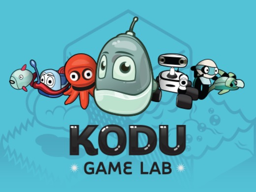

# Kodu  

 { width="100"}

## What is Kodu
Kodu lets kids create games on the PC and Xbox via a simple visual programming language. Kodu can be used to teach creativity, problem solving, storytelling, as well as programming. Anyone can use Kodu to make a game, but its recommended age is 9-14 years. 

Kodu can only be used on Windows computers (sorry Apple users!) 

If you want to download it at home (it's free) click here: 

https://www.microsoft.com/en-us/download/details.aspx?id=10056 

# User Guide 

There is a really good guide to Kodu below which we will be using sections from for our work, please feel free to open and continue to explore further on your own.

|header 1|header2|
|-------|------|
|cell1 | cell2|
